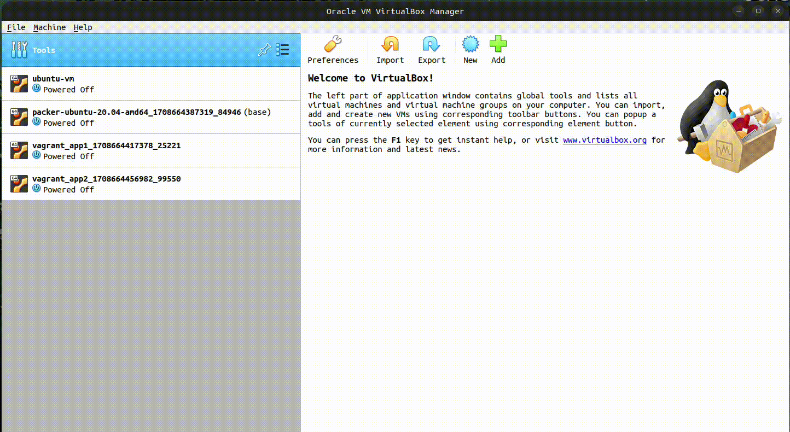
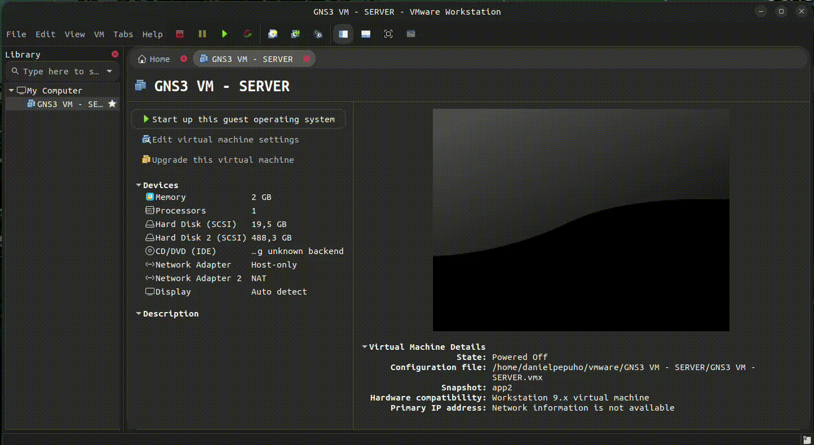
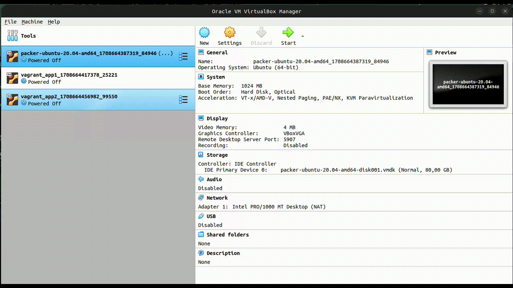
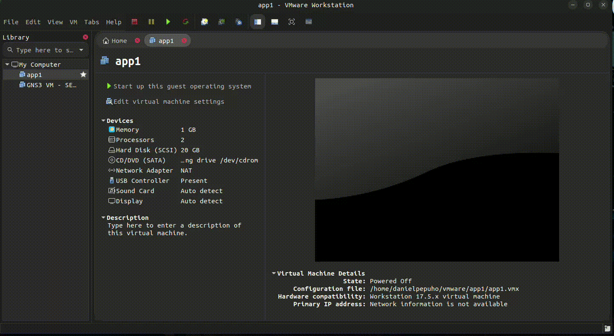
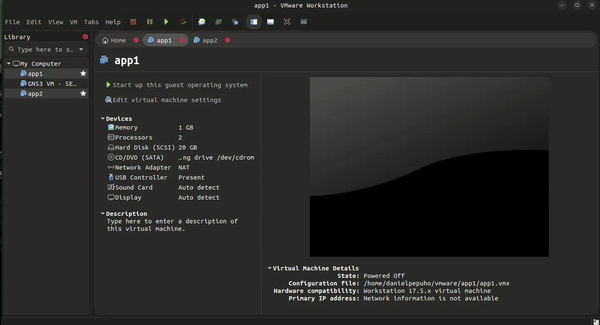
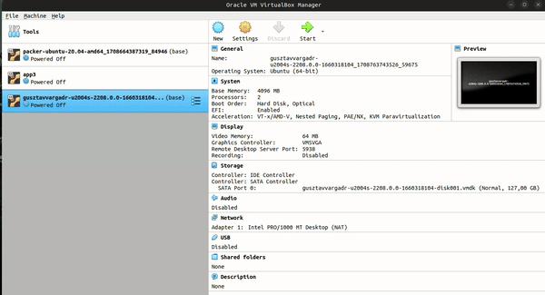

<div align=center>

# Prerequisites

</div>

## Table of Contents

1. [Topologi](#topologi)
2. [Akses Instance](#akses-instance)
3. [Membuat VM di Virtual Box dan VMWare Workstation](#membuat-vm-di-membuat-vm-di-virtual-box-dan-vmware-workstation)
    1. [Menggunakan Vagrant](#menggunakan-vagrant)
    2. [Clone VM](#clone-vm)
4. [Basic Command](#basic-command)

## Topologi

Topologi yang akan kita gunakan pada pelatihan kali ini adalah seperti berikut:


Dimana topologi atau arsitektur yang kita gunakan, bakalan terdiri dari 3 VM atau instances.

1. `Load Balancer`, VM ini akan kita gunakan untuk penerapan load balancing dan server ini akan kita gunakan juga sebagai database utama.
2. `App 1`, adalah server yang akan kita gunakan untuk mendeploy aplikasi frontend dan backend. Kita juga akan menginstal webserver.
3. `App 2`, server ini memiliki fungsi yang sama persis dengan `App 1` dan nantinya bisa menjadi server backup ketika server `App 1` tidak bisa digunakan.

## Akses Instance

Untuk akses ke setiap VM atau instance kita bisa menggunakan `SSH (Secure Shell)`.

A. SSH Menggunakan Windows

B. SSH Menggunakan Linux

1. Download file `.pem` pada link yang telah disediakan.

2. Buka terminal atau console yang kalian miliki. Pastikan kalian membuka terminal di lokasi yang sama dengan file `.pem` yang telah didownload. Terakhir jalankan command `chmod 400 <file_pem>` untuk memberikan permission.


3. Langkah terakhir yaitu akses ke VM atau instance menggunakan `.pem` file dengan menjalankan command `ssh -i <file_pem> <username@ip_address>`.


## Membuat VM di Virtual Box dan VMWare Workstation

Untuk mempercepat pembuatan VM baik di Virtual Box atau VMWare Workstation kalian bisa mengikuti langkah-langkah berikut.

### 1. Menggunakan Vagrant

Requirements:

- [ ] Install [Vagrant >= 2.4.1](https://developer.hashicorp.com/vagrant/install)
- [ ] Install Virtual Box atau VMWare Workstation
- [ ] Silahkan membaca modul [LBE-AJK-2022](https://github.com/arsitektur-jaringan-komputer/lbe-ajk-2022/tree/master/Modul%202#vagrant) untuk langkah-langkah menginstall Vagrant.
- [ ] Pastikan kalian menginstall plugin untuk VMWare: `vagrant plugin install vagrant-vmware` dan utilitasnya: [`Vagrant VMware Utility`](https://developer.hashicorp.com/vagrant/install/vmware#windows)
- [ ] Jangan Lupa mengatur IP di interface `Host-Only` menjadi Static : 192.168.1.1. Cek [disini](#konfigurasi-ip-static-virtual-box)
- [ ] Harap memakai WSL untuk menggunakan command `wget`, jika memakai CMD harap menginstall wget terlebih dahulu: [Install Wget Windows](https://www.niagahoster.co.id/blog/contoh-penggunaan-wget-command/)

- Download Vagrant file melalui link berikut:

Untuk Virtual Box:

```bash
wget https://raw.githubusercontent.com/danielcristho/modul-deployment/master/0.%20Prerequisites/vagrant/Vagrantfile-Vbox -O Vagrantfile
```

Untuk VMWare:

```bash
wget https://raw.githubusercontent.com/danielcristho/modul-deployment/master/0.%20Prerequisites/vagrant/Vagrantfile-VMWare -O Vagrantfile
```

- Selanjutnya jalankan command `vagrant up` untuk membuat vm menggunakan vagrant.


- Selanjutnya untuk mengakses VM yang telah dibuat, bisa menggunakan command `vagrant ssh <hostname_vm>`.


Catatan:

- Untuk mematikan VM bisa menggunakan command `vagrant halt`.
- Untuk destroy VM bisa menggunakan command `vagrant destroy`

#### Konfigurasi IP Static Virtual Box



#### Konfigurasi IP VMWare Workstation



### 2. Clone VM

Silahkan baca modul [Prerequisites Pelatihan Linux](https://github.com/arsitektur-jaringan-komputer/Pelatihan-Linux/tree/master/0.%20Prerequisites) untuk menginstall Ubuntu di VM. Jika sudah kalian bisa meng-clone VM sesuai dengan aplikasi yang digunakan.

#### 1. Virtual Box



#### 2. VMWare



#### Catatan

- Gunakan network adapter `NAT` dan `Host-Only` disetiap VM.




## Basic Command

Silahkan membaca modul **[Pelatihan Linux](https://github.com/arsitektur-jaringan-komputer/Pelatihan-Linux)**.