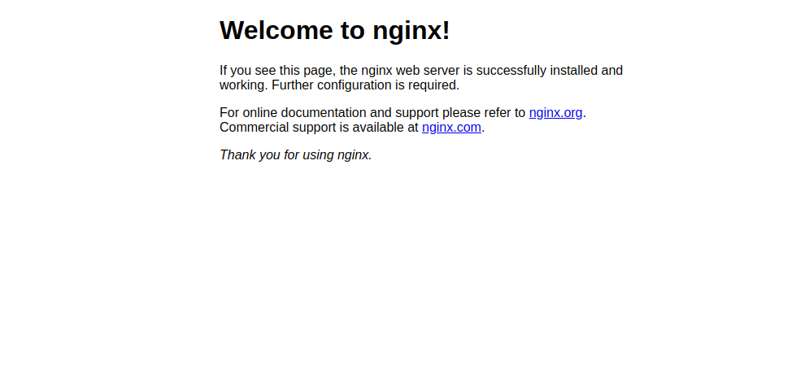
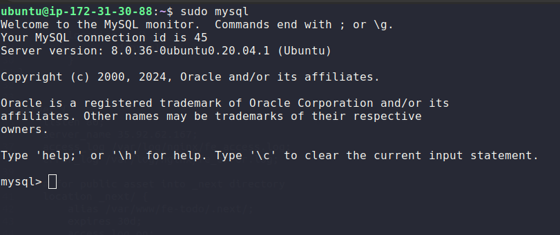

<div align=center>

# Backend Deployment

</div>

## Table of Contents

- [Backend Deployment](#backend-deployment)
    - [LEMP](#lemp-laravel-nginx-mysql--php-stack)
    - [Nginx](#web-server-nginx)
        - [Instalasi Nginx](#instalasi-nginx)
        - [UFW](#ufw-simple-setup)
    - [MySQL](#mysql)
        - [Instalasi MySQL](#instalasi-mysql)
        - [Setup Database & User](#setup-database--user)
    - [PHP](#php)
        - [Instalasi PHP](#instalasi-php)
        - [Setup Laravel Project](#setup-laravel-project)
            - [Clone Project](#clone-project)
            - [Composer](#composer)
            - [Artisan](#artisan)
            - [Nginx Backend](#konfigurasi-nginx-backend)

Prasyarat untuk modul ini, kalian perlu mengakses ke server pastinya sebagai `sudo` non-root reguler.

## Web Server Nginx

### Instalasi Nginx

Untuk menampilkan laman web kepada pengunjung situs kita, kita akan menggunakan [Nginx](https://nginx.org/en/), yang merupakan server web berkinerja tinggi, untuk menginstal Nginx kita bisa menggunakan package manager `apt`. Jika sebelumnya kalian belum melakukan `update`, maka jalankan perintah `sudo apt update`.

```bash
sudo apt update
sudo apt install nginx -y
```

### UFW Simple Setup

Apa itu `UFW (Uncomplicated Firewall)` merupakan firewall bawaan pada Linux, terutama distibusi Ubuntu. Firewall ini cukup sederhana jadi mudah untuk digunakan.

#### 1 - Mengaktifkan UFW

Pertama-tama kalian bisa mengcek status dari ufw dengan menggunakan perintah:

```bash
sudo ufw status
```

Jika sebelumnya belum diaktifkan, maka muncul pesan `Status: inactive`, untuk mengaktifkan ufw cukup dengan perintah:

```bash
sudo ufw enable
```

#### 2 - Memberikan Akses HTTP dan SSH

Selanjutnya kita bakal memberikan akses untuk penggunaan `HTTP` dan `SSH`, caranya yaitu dengan mengetikan perintah:

```bash
sudo ufw allow 'Nginx HTTP'
sudo ufw allow 'OpenSSH'
```

Atau bisa juga dengan menggunakan port:

```bash
sudo ufw allow 80
sudo ufw allow 22
```


Untuk sekarang konfigurasi `ufw` sudah cukup, tapi jika nanti kalian menggunakan `SSL` berarti kalian perlu mengaktifkan akses untuk `HTTPS` atau port `443`. **Perlu diperhatikan karena kita bakal menginstal database atau aplikasi frontend yang berjalan diport tertentu, jika ingin diakses dari luar maka kita perlu mengizinkan (allow) dulu portnya di ufw**.

Selanjutnya jika kalian ingin mengakses laman dari Nginx, dapat dilakukan dengan mengetikan IP Public di browser yang kalian miliki.

```bash
http://<ip_address or domain>
```



## MySQL

### Instalasi MySQL

Setelah berhasil menginstall Nginx, selanjutnya kita perlu menginstall database yang nanti dapat digunakan sebagai penyimpanan dan pengelolaan data yang kita miliki.

```bash
sudo apt install mysql-server -y
```

### Setup Database & User

Untuk mengakses console mysql, cukup menggunakan perintah:

```bash
sudo mysql
```



#### Membuat Database

Untuk membuat database baru, kalian kita bisa menggunakan perintah:

```sql
CREATE DATABASE laravel;
```

```sql
SHOW DATABASES;
```


Selanjutnya kita perlu membuat user baru dan memberikan akses ke databasenya.

```bash
CREATE USER 'USER'@'%' IDENTIFIED BY 'PASSWORD';
GRANT ALL PRIVILEGES ON laravel.* TO 'USER'@'%' WITH GRANT OPTION;
FLUSH PRIVILEGES;
```

#### Testing

Kalian perlu login menggunakan user yang telah dibuat, untuk memastikan apakah usernya dapat mengakses databasenya.

```bash
mysql -u USER -p
```

## PHP

### Instalasi PHP

Selanjutnya perlu menginstall PHP, dimana akan kita gunakan sebagai penghubung ke database dan juga untuk menyajikan konten yang lebih dinamis. Yang perlu perlu diperhatikan pada saat menginstall PHP, yaitu kalian perlu menginstall dependesi tambahan seperti `php-fpm` yang bertugas sebagai penghubung ke Nginx (web server), lalu ada `php-mysql` yang bertugas menjadi penghubung ke database MySQL dan dependensi lainnya sesuai kebutuhan kalian.

Tambahkan repository PHP terlebih dahulu:

```bash
sudo add-apt-repository ppa:ondrej/php -y
sudo apt update
```

```bash
sudo apt-get install php8.1-common php8.1-cli php8.1-mbstring php8.1-xml unzip composer php8.1-curl php8.1-mysql php8.1-fpm php8.1-intl -y
```

Verifikasi instalasi

```bash
php -v
```

### Setup Laravel Project

Untuk backend yang akan kita gunakan yaitu `Laravel`. Laravel sendiri adalah framework PHP yang open-source dan berisi banyak modul dasar untuk mengoptimalkan kinerja PHP dalam pengembangan aplikasi web, apalagi PHP adalah bahasa pemrograman yang dinamis dan Laravel disini bisa bertindak untuk membuat web development lebih cepat, lebih aman, dan lebih simpel.

#### Clone Project

```bash
cd /var/www
sudo git clone https://github.com/elshiraphine/be-todo.git && cd be-todo
```

#### Ubah Permission

```bash
sudo chmod -R 775 .
sudo chown -R www-data:www-data .
```

#### Composer

Apa itu `composer`? `Composer` adalah sebuah tools manajemen dependensi untuk bahasa pemrograman PHP. Dalam konteks pemrograman, Composer adalah sebuah aplikasi yang digunakan untuk mengelola dan mengatur dependensi seperti library, framework, atau paket lain yang diperlukan dalam proyek PHP.

#### Install

Pastikan kalian berada di direktori `be-todo`, lalu kalian perlu menginstal beberapa library menggunakan `composer`.

```bash
composer install
```

#### Update & Upgrade (optional)

```bash
sudo composer update
```

```bash
sudo which composer
sudo php -r "copy('https://getcomposer.org/installer', 'composer-setup.php');"
sudo php composer-setup.php --install-dir=/usr/bin --filename=composer
```

#### Artisan

`Artisan` adalah sebuah file yang berisi command-line interface (CLI) yang disediakan oleh Laravel untuk membantu pengembangan aplikasi dengan menyediakan berbagai perintah yang dapat digunakan untuk melakukan tugas-tugas umum seperti membuat model, controller, migrasi database, menjalankan unit test, dan masih banyak lagi.

#### Membuat Project Environment

Masih di direktori `/var/www/be-todo`, kita akan menjalankan beberapa perintah.

```bash
cp .env.example .env
```

Edit file `.env`

```bash
nano .env
```

```bash
APP_NAME=Laravel
APP_ENV=local
APP_KEY=
APP_DEBUG=true
APP_URL=http://localhost

LOG_CHANNEL=stack
LOG_LEVEL=debug
LOG_DEBUG=true

DB_CONNECTION=mysql
DB_HOST=<IP_LB>
DB_PORT=3306
DB_DATABASE=laravel
DB_USERNAME=<USERNAME>
DB_PASSWORD=<PASSWORD>
```

Jalankan beberapa perintah menggunakan `artisan`

```bash
php artisan key:generate
php artisan migrate
```

#### Konfigurasi Nginx Backend


```bash
sudo nano /etc/nginx/sites-available/backend
```

```bash
server {
        root /var/www/be-todo/public;
        index index.php index.html index.htm index.nginx-debian.html;

        server_name localhost;
        listen 9000;

        access_log /var/log/nginx/be_access.log;
        error_log /var/log/nginx/be_error.log;

        # CORS Configuration
        add_header 'Access-Control-Allow-Origin' '*' always;
        add_header 'Access-Control-Allow-Methods' '*' always;
        add_header 'Access-Control-Allow-Headers' '*' always;

        location / {
                try_files $uri $uri/ /index.php?$query_string;
        }

        location ~ \.php$ {
                include snippets/fastcgi-php.conf;
                fastcgi_pass unix:/var/run/php/php8.1-fpm.sock;
        }

        location ~ /\.ht {
                deny all;
        }
}
```

Membuat symlink

```bash
sudo ln -s /etc/nginx/sites-available/backend /etc/nginx/sites-enabled
sudo service nginx restart
```

Selanjutnya coba akses backend menggunakan curl:

```bash
curl http://localhost:9000
```

atau melalui browser

```bash
http://IP_WORKER:9000
```

#### Troubleshooting

##### - default page dari Nginx masih muncul

```bash
sudo unlink /etc/nginx/sites-enaled/default
```


