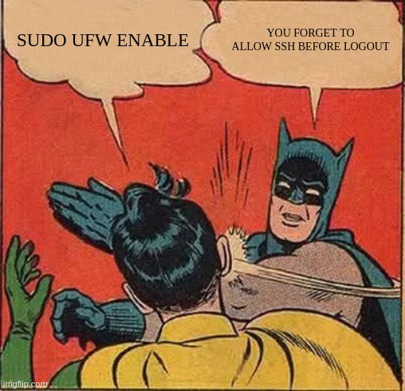

<div align=center>

# Backend Deployment

</div>

## Table of Contents

## LEMP (Laravel, Nginx, MySQL & PHP) Stack

LEMP stack adalah sekumpulan perangkat lunak yang dapat digunakan untuk menyajikan laman web dan aplikasi web dinamis yang ditulis dalam PHP. Ini adalah akronim yang mendeskripsikan sistem operasi Linux, dengan web server Nginx (diucapkan seperti “Engine-X”). Data backend disimpan di dalam database MySQL, dan pemrosesan dinamis ditangani oleh PHP.

Prasyarat untuk modul ini, kalian perlu mengakses ke server pastinya sebagai `sudo` non-root reguler.

## Instalasi Web Server Nginx

Untuk menampilkan laman web kepada pengunjung situs kita, kita akan menggunakan [Nginx](https://nginx.org/en/), yang merupakan server web berkinerja tinggi, untuk menginstal Nginx kita bisa menggunakan package manager `apt`. Jika sebelumnya kalian belum melakukan `update`, maka jalankan perintah `sudo apt update`.

```bash
sudo apt update
sudo apt install nginx -y
```

### UFW Simple Setup

Apa itu `UFW (Uncomplicated Firewall)` merupakan firewall bawaan pada Linux, terutama distibusi Ubuntu. Firewall ini cukup sederhana jadi mudah untuk digunakan.

#### 1 - Mengaktifkan UFW

Pertama-tama kalian bisa mengcek status dari ufw dengan menggunakan perintah:

```bash
sudo ufw status
```

Jika sebelumnya belum diaktifkan, maka muncul pesan `Status: inactive`, untuk mengaktifkan ufw cukup dengan perintah:

```bash
sudo ufw enable
```

#### 2 - Memberikan Akses HTTP dan SSH

Selanjutnya kita bakal memberikan akses untuk penggunaan `HTTP` dan `SSH`, caranya yaitu dengan mengetikan perintah:

```bash
sudo ufw allow 'Nginx HTTP'
sudo ufw allow 'OpenSSH'
```

Atau bisa juga dengan menggunakan port:

```bash
sudo ufw allow 80
sudo ufw allow 22
```



Untuk sekarang konfigurasi `ufw` sudah cukup, tapi jika nanti kalian menggunakan `SSL` berarti kalian perlu mengaktifkan akses untuk `HTTPS` atau port `443`. **Perlu diperhatikan karena kita bakal menginstal database atau aplikasi frontend yang berjalan diport tertentu, jika ingin diakses dari luar maka kita perlu mengizinkan (allow) dulu portnya di ufw**.

Selanjutnya jika kalian ingin mengakses laman dari Nginx, dapat dilakukan dengan mengetikan IP Public di browser yang kalian miliki.

```bash
http://<ip_address or domain>
```


## Instalasi MySQL

Setelah berhasil menginstall Nginx, selanjutnya kita perlu menginstall database yang nanti dapat digunakan sebagai penyimpanan dan pengelolaan data yang kita miliki.

```bash
sudo apt install mysql-server -y
```

### Database Setup

```bash
sudo mysql
```

