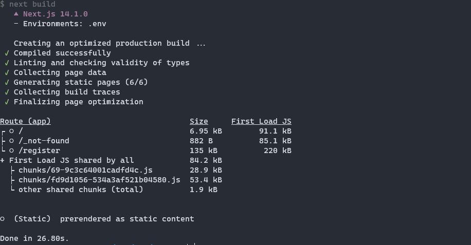

<div align=center>

# Frontend Deployment

</div>

## Table of Contents
1. [Package Installation](#package-installation)
2. [pm2 Setup](#pm2-setup)
3. [Deploy ke Nginx](#deploy-ke-nginx)


### Package Installation

Langkah pertama dalam melakukan *deployment* aplikasi *Frontend* adalah melakukan instalasi package yang digunakan.

Pertama, lakukan instalasi `nvm`. `nvm` merupakan *version manager* untuk node.js. Gunakan perintah di bawah ini untuk menginstall `nvm`.

```sh
curl -o- https://raw.githubusercontent.com/nvm-sh/nvm/v0.39.1/install.sh | bash
source ~/.bashrc
```

Kemudian langkah selanjutnya adalah melakukan instalasi `yarn` yang merupakan *package manager* untuk JavaScript.

```sh
curl -sS https://dl.yarnpkg.com/debian/pubkey.gpg | sudo apt-key add -
echo "deb https://dl.yarnpkg.com/debian/ stable main" | sudo tee /etc/apt/sources.list.d/yarn.list
sudo apt-get update
sudo apt-get install yarn -y
```

Kemudian lakukan clone [repositori berikut](https://github.com/elshiraphine/fe-todo.git) pada direktori `/var/www/`. Setelah selesai melakukan clone, check versi aplikasi yang dibangun pada `package.json`.


Karena pada `package.json` menunjukkan versi next adalah versi `14.1.0` maka berdasarkan [dokumentasi berikut](https://nextjs.org/docs/app/building-your-application/upgrading/version-14), versi `node` yang digunakan adalah **18**.

Lakukan instalasi node versi 18 dengan perintah berikut:

```sh
nvm install 18
nvm alias default 18
```

Selanjutnya lakukan instalasi `pm2`. `pm2` ini adalah *process manager* untuk aplikasi Node.js. Perintahnya adalah sebagai berikut:

```sh
sudo apt install npm
npm install pm2 -g
```

### pm2 Setup

Langkah selanjutnya adalah melakukan setup pada `pm2`. Sebelum melakukan setup `pm2` lakukan instalasi package dan build pada repo.

Lakukan *change directory* pada `/var/www/fe-todo`

```sh
cd /var/www/fe-todo
```

Kemudian gunakan perintah `yarn install --ignore-engines && yarn build`. Perintah tersebut setelah dijalankan akan menampilkan berikut:




Kemudian, jalankan perintah berikut untuk membuat proses

```sh
pm2 start --name fe-todo "yarn start"
```

Hasilnya adalah sebagai berikut:


### Deploy ke Nginx

Langkah terakhir dalam melakukan *deployment* aplikasi frontend adalah membuat konfigurasi pada Nginx.

Lakukan change directory pada `/etc/nginx/sites-available`. Kemudian buatlah konfigurasi dengan nama file `fe` sesuai script di bawah ini:

```
server {
    listen 80;
    server_name _;
    access_log /var/log/nginx/fe_access.log;
    error_log /var/log/nginx/fe_error.log;

    # for public asset into _next directory
    location _next/ {
        alias /var/www/fe-todo/.next/;
        expires 30d;
        access_log on;
    }

    location / {
        proxy_pass http://localhost:3000;
        proxy_http_version 1.1;
        proxy_set_header Upgrade $http_upgrade;
        proxy_set_header Connection 'upgrade';
        proxy_set_header Host $host;
        proxy_cache_bypass $http_upgrade;
    }
}
```

`proxy_pass` di sini akan melakukan passing dari alamat `http://localhost:3000` yang dijalankan oleh `pm2`.

Kemudian simpan konfigurasi tersebut.

Setelah itu, link konfigurasi pada `sites-available` dengan `sites-enabled` menggunakan perintah berikut:

```sh
sudo ln -s /etc/nginx/sites-available/fe /etc/nginx/sites-enabled/
```

Kemudian restart service nginx:

```
service nginx restart
```

dan cek status nginx

