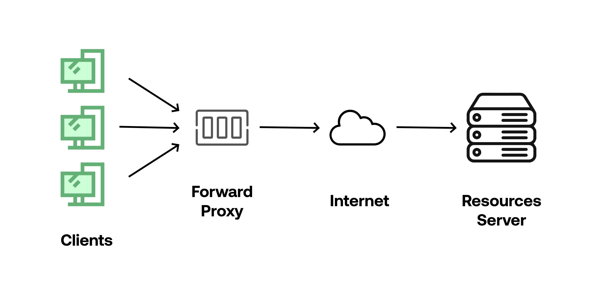

<div align=center>

# Load Testing

</div>

## Table of Contents

1. [Reverse Proxy](#reverse-proxy)
2. [Load Balancing](#load-balancing)
3. [Load Testing dan Monitoring](#apa-itu-process)
4. [Logging](#perintah-terkait-process)
5. [Implementasi](#apa-itu-process)

## Reverse Proxy

Sebelum mengenal Reverse Proxy lebih jauh, perlu diketahui bahwa Reverse Proxy dan Proxy Service, seperti Forward Proxy adalah 2 hal yang berbeda dari cara kerjanya. Sesuai fungsinya masing-masing, `Forward Proxy` berfungsi untuk menyembunyikan identitas client dari server, sedangkan `Reverse Proxy` berfungsi untuk menyembunyikan identitas server dari client.

**A. Forward Proxy**

Secara singkat Forward Proxy adalah service yang disediakan oleh suatu server, dimana server ini akan menjadi perantara bagi kita dan server atau website tujuan. Jadi ketika kita mengakses suatu website yang ada di internet kita akan terlebih dahulu terhubung ke Proxy Server.

Proxy server juga cukup efektif digunakan sebagai sebuah gateway. Nantinya, semua koneksi yang dilakukan akan sesuai dengan setting gateway yang ditetapkan.



Klien tidak langsung terhubung ke server tujuan, sehingga server tujuan tidak mengetahui alamat IP asli klien. Sebaliknya, server tujuan hanya melihat alamat IP dari forward proxy.

**B. Reverse Proxy**

Sedangkan `Reverse Proxy` adalah salah satu jenis server Proxy yang bertanggung jawab dalam meneruskan request client ke server. Reverse Proxy terletak diantara client dan server. Jadi, request yang dilakukan client akan diteruskan oleh Reverse Proxy untuk mencapai ke server. Mudahnya, Reverse Proxy adalah proxy server yang berada di sisi server.

Reverse Proxy biasanya diterapkan pada web server seperti Apache dan Nginx. Selain itu, Reverse Proxy juga digunakan sebagai keamanan agar proses pertukaran request dari client ke server atau sebaliknya berjalan dengan aman.

Reverse Proxy juga bisa melakukan kompresi data. Data yang besar akan dilakukan kompresi sehingga menjadi data dengan ukuran yang lebih kecil. Hal itu dapat membuat pertukaran data berjalan lebih cepat. Reverse Proxy juga memiliki kemampuan untuk menyeimbangkan load atau beban server agar server tidak down (`Load Balancing`).


Klien tidak langsung mengakes server tujuan, sehingga klien tidak mengetahui ip asli dari server akan tetapi hanya ip reverse proxy.

## Load Balancing

Seperti yang sempat disebut sebelumnya, `Load Balancing` adalah teknik untuk mendistribusikan beban kerja di antara dua atau lebih server sehingga tidak ada satu sumber daya yang terbebani lebih dari yang lainnya. Load Balancing juga dapat memastikan bahwa server tidak down atau tidak overload.

Pada load balancing, terdapat beberapa algoritma yang digunakan untuk mendistribusikan beban kerja di antara server-server yang ada. Berikut adalah beberapa algoritma yang digunakan:

**A. Round Robin**

Merupakan algoritma load balancing default yang ada di Nginx, cara kerjanya yaitu jika kita memiliki 3 buah node, maka urutannya adalah dari node pertama, kemudian node kedua, dan ketiga. Setelah node ketiga menerima beban, maka akan diulang kembali dari node ke satu.

**B. Least Connections**

Algoritma ini akan mendistribusikan beban kerja ke server yang memiliki koneksi terendah. Jadi, server yang memiliki koneksi terendah akan mendapatkan beban kerja lebih banyak.

**C. IP Hash**

Algoritma ini akan mendistribusikan beban kerja ke server berdasarkan IP Address dari client. Jadi, client yang memiliki IP Address yang sama akan dihandle oleh server yang sama pula. Mudahnya jika client A mengakses server A, maka client A akan selalu dihandle oleh server A.

**D. Weighted Round Robin**

Algoritma ini akan mendistribusikan beban kerja ke server berdasarkan bobot yang telah ditentukan. Jadi, server yang memiliki bobot lebih besar akan mendapatkan beban kerja lebih banyak.

## Load Testing dan Monitoring

`Load Testing` adalah proses untuk menguji kinerja suatu aplikasi atau website dengan memberikan beban kerja yang tinggi. Tujuan dari load testing adalah untuk mengetahui sejauh mana aplikasi atau website mampu menangani beban kerja yang tinggi.

Ada beberapa tools yang dapat digunakan untuk melakukan load testing dan Monitoring, diantaranya adalah:

**A. Apache JMeter**

Apache JMeter adalah salah satu tools yang digunakan untuk melakukan load testing. JMeter dapat digunakan untuk melakukan load testing pada berbagai protokol seperti HTTP, HTTPS, FTP, JDBC, LDAP, dan masih banyak lagi.

**Instalasi**

- Pada Linux
  ```bash
  sudo apt-get install jmeter
  ```
- Pada Windows
  Download Apache JMeter [disini](https://jmeter.apache.org/download_jmeter.cgi)

**B. Apache Benchmark**

Apache Benchmark adalah tools yang digunakan untuk melakukan load testing pada web server. Apache Benchmark dapat digunakan untuk melakukan load testing pada web server yang menggunakan protokol HTTP dan HTTPS.

**Instalasi**

- Pada Linux
  ```bash
  sudo apt-get install apache2-utils
  ```
- Pada Windows
  Download Apache Benchmark [disini](https://www.apachehaus.com/cgi-bin/download.plx)

**C. HTOP**

HTOP adalah tools yang digunakan untuk melakukan monitoring pada server. HTOP dapat digunakan untuk melihat penggunaan CPU, RAM, dan SWAP pada server.

**Instalasi**

```bash
sudo apt-get install htop
```

## Logging

`Logging` adalah proses untuk mencatat aktivitas yang terjadi pada server. Logging sangat penting untuk dilakukan karena dengan

log file nginx secara default berada di `/var/log/nginx/` dan log file apache secara default berada di `/var/log/apache2/`

Dan pada Nginx log file terbagi menjadi 2 yaitu `access.log` dan `error.log`. `access.log` berisi log dari request yang masuk ke server, sedangkan `error.log` berisi log dari error yang terjadi pada server. Format file log pada nginx adalah dalam format `combined` yang berisi informasi seperti IP Address, waktu request, request, status code, dan ukuran response.

Berikut contoh accces.log pada nginx:


Berikut contoh error.log pada nginx:


## Implementasi
